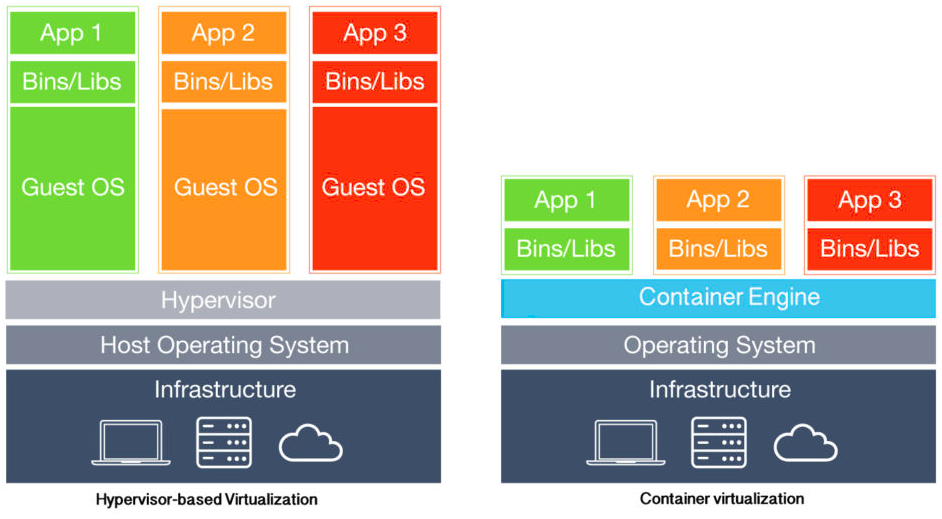

# Docker

## Concepto

Docker es un software que se utiliza principalmente para desplegar aplicaciones en espacios virtualizados. Estos espacios son conocidos como contenedores. Su uso está muy extendido y se utiliza mucho en equipos de desarrollo para desplegar de forma fácil y rápida las aplicaciones con las que trabajan sin interferir directamente en el resto de la computadora. Se podría decir que permite crear pequeñas computadoras efímeras, de usar y tirar.

En los siguientes puntos explicaré en detalle el funcionamiento y la utilización de Docker con algunos ejemplos.

## Máquina virtual Vs. Contenedores Docker

Hasta no hace mucho tiempo la manera de desplegar microservicios o pequeñas aplicaciones de forma independiente en una misma máquina era utilizando máquinas virtuales. Una máquina virtual es realmente una instalación de un sistema operativo dentro de otro sistema operativo, y para ello se utiliza un software llamado Hipervisor, que es quien nos permite poder tener múltiples sistemas en una misma máquina con independencia de recursos como pueden ser disco memoria, procesos, etc.

<p align="center"></p>
<br>

Este tipo de instalaciones mediante un hipervisor son bastante pesadas y difíciles de mantener y administrar, pues se trata de la instalación de uno o más sistemas operativos huépedes al completo dentro de un sistema operativo anfitrión. Este sistema operativo anfitrión deberá ser una máquina muy potente y con muchos recursos.

Docker propone un sistema en el que no se tenga que instalar un sistema operativo completo dentro de otro, sino aprovechar las características y recursos que ya esten disponibles en l amáquina anfitriona y compartirlos a través de una pieza fundamental llamada `Docker Engine`, es el motor de Docker, que no es más que un servicio corriendo en la máquina anfitriona en el que podremos desplegar los diferentes contenedores que solo compartirán la misma base del sistema operativo anfitrión.

Obviamente, dentro de cada contenedor encontraremos sus propias características, sus propias librerías, y una serie de recursos que podremos compartir para hacerlos visibles a otros contenedores o a la máquina anfitriona.


## Instalación de Docker

Para instalar Docker primero deberemos actualizar la información sobre paquetes que tenemos en nuestros repositorios locales mediante el siguiente comando:

```bash
~$ sudo apt-get update
Hit:1 http://archive.ubuntu.com/ubuntu xenial InRelease
Get:2 http://archive.ubuntu.com/ubuntu xenial-updates InRelease [109 kB]                             
Get:3 http://security.ubuntu.com/ubuntu xenial-security InRelease [109 kB]                                     
Get:4 http://archive.ubuntu.com/ubuntu xenial-backports InRelease [107 kB]        
Get:5 http://archive.ubuntu.com/ubuntu xenial-updates/main amd64 Packages [1,150 kB]         
Get:6 http://archive.ubuntu.com/ubuntu xenial-updates/main i386 Packages [923 kB]             
Get:7 http://archive.ubuntu.com/ubuntu xenial-updates/main Translation-en [435 kB]       
Get:8 http://archive.ubuntu.com/ubuntu xenial-updates/universe amd64 Packages [798 kB]     
Get:9 http://archive.ubuntu.com/ubuntu xenial-updates/universe i386 Packages [721 kB]
Get:10 http://security.ubuntu.com/ubuntu xenial-security/main amd64 Packages [872 kB]
Get:11 http://security.ubuntu.com/ubuntu xenial-security/main i386 Packages [665 kB]
Get:12 http://security.ubuntu.com/ubuntu xenial-security/main Translation-en [328 kB]
Fetched 7,332 kB in 2s (3,523 kB/s)                             
Reading package lists... Done
```

A continuación debemos instalar algunos paquetes adicionales que nos harán falta como dependencias para permitir que su sistema operativo acceda a los repositorios de Docker a través de HTTPS. Para ello ejecutaremos el siguiente comando:

```bash
~$ sudo apt-get install apt-transport-https ca-certificates curl software-properties-common
Reading package lists... Done
Building dependency tree       
Reading state information... Done
ca-certificates is already the newest version (20170717~16.04.2).
ca-certificates set to manually installed.
curl is already the newest version (7.47.0-1ubuntu2.14).
software-properties-common is already the newest version (0.96.20.9).
software-properties-common set to manually installed.
The following NEW packages will be installed:
  apt-transport-https
0 upgraded, 1 newly installed, 0 to remove and 21 not upgraded.
Need to get 26.7 kB of archives.
After this operation, 216 kB of additional disk space will be used.
Do you want to continue? [Y/n] Y
Get:1 http://archive.ubuntu.com/ubuntu xenial-updates/main amd64 apt-transport-https amd64 1.2.32ubuntu0.1 [26.7 kB]
Fetched 26.7 kB in 0s (265 kB/s)              
Selecting previously unselected package apt-transport-https.
(Reading database ... 89418 files and directories currently installed.)
Preparing to unpack .../apt-transport-https_1.2.32ubuntu0.1_amd64.deb ...
Unpacking apt-transport-https (1.2.32ubuntu0.1) ...
Setting up apt-transport-https (1.2.32ubuntu0.1) ...
```

Aquí una breve descripción sobre cada uno de los paquetes que acabamos de instalar:

* **apt-transport-https**: Permite que el administrador de paquetes transfiera archivos y datos a través de HTTPS.
* **ca-certificates**: Permite que el sistema (y el navegador web) verifiquen los certificados de seguridad.
* **curl**: Esta es una herramienta muy popular para transferir datos.
* **software-properties-common**: Agrega scripts para administrar software.

Para asegurarnos de que el software que estamos instalando es auténtico verificaremos la integridad del mismo usando GPG mediante el siguiente comando:

~$ sudo curl -fsSL https://download.docker.com/linux/ubuntu/gpg | apt-key add -
OK

Ahora tenemos que añadir el repositorio oficial de Docker a nuestra lista de repositorios, de ese modo todo el software que exista en dichos repositorios estará disponible para ser instalado cuando lo necesitemos:

```bash
~$ sudo add-apt-repository "deb [arch=amd64] https://download.docker.com/linux/ubuntu  $(lsb_release -cs)  stable"
```

Como hemos añadido un nuevo repositorio ahora debemos actualizar de nuevo la base de datos donde se incluye todo el software que hay en un repositorio. Para ello ejecutamos el siguiente comando:

```bash
~$ apt-get update
Hit:1 http://archive.ubuntu.com/ubuntu xenial InRelease
Hit:2 http://archive.ubuntu.com/ubuntu xenial-updates InRelease         
Get:3 https://download.docker.com/linux/ubuntu xenial InRelease [66.2 kB]
Hit:4 http://archive.ubuntu.com/ubuntu xenial-backports InRelease                                    
Hit:5 http://security.ubuntu.com/ubuntu xenial-security InRelease       
Get:6 https://download.docker.com/linux/ubuntu xenial/stable amd64 Packages [13.6 kB]
Fetched 79.8 kB in 0s (139 kB/s)                        
Reading package lists... Done
```

Ahora es el momento de instalar la última versión de Docker mediante el siguiente comando:

```bash
~$ sudo apt-get install docker-ce
Reading package lists... Done
Building dependency tree       
Reading state information... Done
The following additional packages will be installed:
  aufs-tools cgroupfs-mount containerd.io docker-ce-cli git git-man iptables liberror-perl libgdbm3 libltdl7 libnfnetlink0 libperl5.22 patch perl perl-modules-5.22 pigz rename rsync
Suggested packages:
  mountall git-daemon-run | git-daemon-sysvinit git-doc git-el git-email git-gui gitk gitweb git-arch git-cvs git-mediawiki git-svn ed diffutils-doc perl-doc libterm-readline-gnu-perl
  | libterm-readline-perl-perl make
The following NEW packages will be installed:
  aufs-tools cgroupfs-mount containerd.io docker-ce docker-ce-cli git git-man iptables liberror-perl libgdbm3 libltdl7 libnfnetlink0 libperl5.22 patch perl perl-modules-5.22 pigz rename rsync
0 upgraded, 19 newly installed, 0 to remove and 21 not upgraded.
Need to get 95.7 MB of archives.
After this operation, 449 MB of additional disk space will be used.
Do you want to continue? [Y/n] Y
Get:1 http://archive.ubuntu.com/ubuntu xenial/main amd64 libgdbm3 amd64 1.8.3-13.1 [16.9 kB]
Get:2 http://archive.ubuntu.com/ubuntu xenial/main amd64 libnfnetlink0 amd64 1.0.1-3 [13.3 kB]
Get:3 http://archive.ubuntu.com/ubuntu xenial-updates/main amd64 perl-modules-5.22 all 5.22.1-9ubuntu0.6 [2,629 kB]
…
…
…
Setting up libltdl7:amd64 (2.4.6-0.1) ...
Setting up patch (2.7.5-1ubuntu0.16.04.2) ...
Setting up rename (0.20-4) ...
update-alternatives: using /usr/bin/file-rename to provide /usr/bin/rename (rename) in auto mode
Processing triggers for libc-bin (2.23-0ubuntu11) ...
Processing triggers for systemd (229-4ubuntu21.27) ...
Processing triggers for ureadahead (0.100.0-19.1) ...
```

Para asegurarnos de que hemos instalado correctamente Docker podremos ejecutar el siguiente comando que nos devolverá la versión instalada:

```bash
~$ sudo docker --version
Docker version 19.03.9, build 9d988398e7
```

## Administrar Docker sin sudo
Primero hay que meter el usuario en el sudoers file. Para ello, como root se debe ejcutar el siguiente comando:
```bash
~# usermod -aG sudo alice
```

Luego añadirlo al grupo docker:
```bash
~$ sudo gpasswd -a alice docker
```

## ¿Qué es una imagen?

Una imagen Docker es una plantilla con una configuración específica que nos servirá para crear un tipo de objetos virtuales llamados contenedores, es decir un "molde" a partir del cual podremos obtener máquinas virtuales con la misma configuración, programas y características de base. Las imágenes las podemos crear o compilar nosotros mismo, pero también podemos utilizar cualquiera de las que han creado otras personas y empresas, y que están disponibles de froma pública en repositrios de imágenes como [DockerHub](https://hub.docker.com/), hay cientos de imágenes disponibles.

Si quisieramos crear una imagen Docker nosotros mismos debemos compilarla en nuestra máquina local. Para ello es necesario crear un archivo llamado `Dockerfile` y escribir dentro de él una serie de intrucciones. Aquí tendríamos un ejemplo de cómo sería el contenido de un archivo `Dockerfile` mínimo:
```

```


## ¿Qué es un contenedor?
