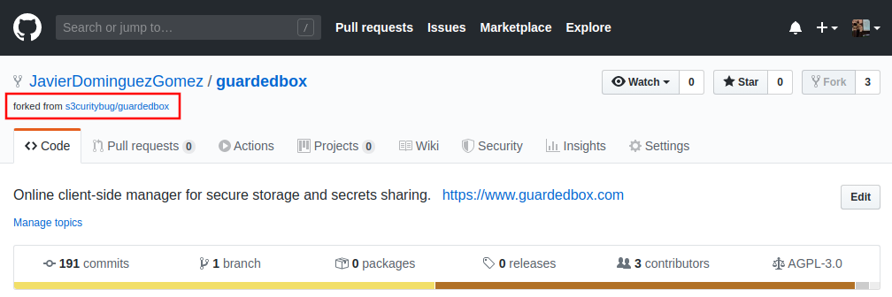

# Fork de un repositorio existente

El primer paso para colaborar con un proyecto en GitHub es hacer un fork. Un fork es una copia de un repositorio de GitHub independiente del repositorio original. Nosotros somos los dueños de ese fork, por lo que podemos hacer todos los cambios que queramos, aunque no tengamos permisos de escritura en el repositorio original.

# Creando un fork desde GitHub
Crear un fork desde GitHub es muy sencillo. Ve a la página principal del repositorio del que quieras hacer un fork y pulsa el botón fork.

<p align="center"></p>
<br>

Una vez completado el fork, nos aparecerá en nuestra cuenta el repositorio "*forkeado*":

<p align="center"></p>
<br>

## Clonando el repositorio en local
Una vez creado, podemos hacer una copia del repositorio en nuestro PC para editarlo. Para ello, abrimos una terminal e introducimos los siguientes comandos:
```bash
~$ git clone <url_del_repo>
```
Por ejemplo:
```bash
~$ git clone https://github.com/JavierDominguezGomez/guardedbox.git
```

## (opcional) Añadiendo el repositorio original a los repositorios remotos
Un repositorio remoto (*remote*) es un repositorio online desde el que descargar nuestros cambios en el repositorio local. Al clonar un repositorio, se crea un remoto llamado `origin`, que corresponde a nuestro fork. Para poder disponer de los cambios que se hagan en el repositorio principal, podemos añadir un remoto `upstream` que apunte al repositorio original:
```bash
~$ git remote add upstream <url_del_repo_original>
```
Una vez añadido, podemos bajar cambios del repositorio original con un pull:
```bash
~$ git pull upstream <rama_a_descargar>
```

Siguiendo con el ejemplo de antes:
```bash
~$ git remote add upstream https://github.com/s3curitybug/guardedbox.git
~$ git pull upstream master
```

El resultado de ambos pasos debería ser el siguiente:

<p align="center"></p>
<br>
