## Timechain o Blockchain

### Definición objetiva y formal

La definición de *Blockchain* históricamente ha sido bastante controvertida. Tal y como lo conocemos se implementa por primera vez en la creación de *Bitcoin* en 2008. Realmente la palabra “*Blockchain*” no aparece el paper de *Bitcoin* ni en ninguna mención de su creador *Satoshi Nakamoto*, de hecho él lo llamaba *timechain*. El término “*Blockchain*” se encuentra por primera vez en un mensaje de un usuario en *Bitcoin*Talk, un foro creado específicamente para hablar sobre *Bitcoin*, y esto sucede algo más de un año después de su lanzamiento en 2009. A partir de ahí, en la mayoría de foros de discusión sobre esta temática se habla de “*Tecnología Blockchain*” o “*Base de datos descentralizada*”.

Aunque desde un punto de vista subjetivo se puedan aportar matices más o menos acertados, la definición objetiva, formal y técnica más aceptada por los principales desarrolladores y la comunidad tecnológica (seria) implicada en su investigación, desarrollo y mantenimiento dice que se trata de un “**protocolo de sincronización de bases de datos**”. Esto no implica que el resto de definiciones a grandes rasgos sean erróneas, de hecho hoy en día son ampliamente aceptadas, hay que tener en cuenta que se trata de la definición de un recurso tecnológico lo suficientemente complejo como para sintetizarlo en pocas palabras sin omitir todas las características que lo componen.

<p align="center">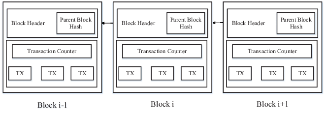</p>
<br>

Obviamente hay muchos matices y atributos que lo diferencian del resto de protocolos de comunicación que tienen un propósito similar o parecido, pero en una definición reducida a una frase no tienen cabida, sí en una explicación más detallada sobre ingeniería de software, arquitectura o análisis del criptosistema que emplea.

### Propósito general

El paper de *Bitcoin* tiene como título en “*Bitcoin: A Peer-to-Peer Electronic Cash System*”, es decir, **un sistema de efectivo electrónico Usuario-a-Usuario**. Lo que propone es un sistema para transacciones electrónicas sin tener que confiar en terceros. Para ello emplea firmas digitales, un criptosistema que además resuelve el problema del doble gasto y una red descentralizada de computadoras que se encargan de almacenar, procesar y validar la información que se va generando a lo largo del tiempo. Además de ser un sistema de efectivo tiene otros propósitos esenciales y muy importantes como son la **resistencia a la censura**, garantizar cierto grado de **privacidad** y **reserva de valor**.

### Origen y desarrollo, hasta hoy

El origen del protocolo *Blockchain* también es bastante controvertido y lleno de polémica. La idea original del dinero electrónico y algunas de sus aplicaciones y características son mucho anteriores a *Bitcoin*, otras personas ya pensaron de un modo u otro en ello y crearon sistemas similares y con cualidades en común, como *eCash* (1990) de *David Chaum*, los *Smart Contracts* (1994) y *BitGold* (1998, solo la idea, nunca lo llegó a desarrollar) de *Nick Szabo*, *Hashcash* (1997) de *Adam Back* en el que se implementa una prueba de trabajo (*proof-of-work*) de modo que verificar la integridad de la información tenga un coste computacional, o *b-money* (1998) de *Wei Dai*, que utilizaba *Hashcash* de *Adam Back* para la minería de su moneda.

Las personas anteriormente citadas eran algunos de los miembros de la famosa lista de correo *Cypherpunks* (1992), donde estaban otras personas influyentes e importantes como *Richard Stallman*, *Eric Hughes*, *Timothy C. May*, *John Gilmore* o *Julian Assange*. De ahí nacerían proyectos tan importantes como la *Electronic Frontier Foundation* (EFF) o *WikiLeaks*.

En el año 2008 *Satoshi Nakamoto* compartió con algunas personas a través de internet las primeras ideas y bocetos de lo que luego sería *Bitcoin*, puesto en marcha oficialmente el 3 de enero de 2009. La primera transacción de *Bitcoin* fue entre el propio Satoshi y otro *Cypherpunk* llamado *Harold “Hal” Thomas Finney*, bastante conocido entre los criptógrafos de la época por haber colaborado en el desarrollo de *Pretty Good Privacy* (PGP) junto a *Phil Zimmermann*, además de ser un brillante programador.

<p align="center"></p>
<br>

El código del protocolo *Bitcoin* es publicado y liberado desde el primer momento bajo una licencia MIT, lo que lo convierte en *Software Libre*, así pues la comunidad de desarrolladores de software interesados en este protocolo dedican tiempo y esfuerzo no solo en leer, estudiar y comprender el código fuente de *Bitcoin*, sino que algunos deciden crear sus propias versiones modificadas y pueden distribuirlas bajo otros nombres y con nuevas características. En febrero de 2011 ya había más de 95 proyectos derivados del protocolo *Bitcoin*, y hacia finales del mismo año surgen una versión muy conocida, Litecoin. A mediados de 2015 aparece un nuevo protocolo llamado *Ethereum* creado por *Vitalik Buterin* y *Gavin Wood*, este protocolo nuevo tiene muchas de las características de *Bitcoin* pero su código es original, está reescrito desde cero, y se puede decir que es una de las tecnología de este tipo más populares y utilizadas que hay, y que más aplicaciones genera. Uno de los propósitos generales de *Ethereum* respecto al resto de símiles ya existentes es la de poder crear aplicaciones descentralizadas de una manera mucho más sencilla que el resto de protocolos similares. Se hablará de ello más en profundidad en las siguientes secciones de este documento.

Hoy en día existe una gran cantidad de protocolos de tipo *Blockchain*, e incluso algunos que presentan nuevos paradigmas que no son *Blockchain* como *IOTA*, en los que la información es tratada de forma similar pero con unas cualidades específicas (*Tangle*) que lo hacen totalmente diferente.

La página mapofcoins.com ofrece de forma muy clara diferentes gráficos en los que se pueden ver los principales protocolos *Blockchain*, información de los mismos y sus derivaciones a lo largo del tiempo.

## Arquitectura de red

### Sistemas Centralizados Vs. Descentralizados Vs. Distribuidos

En el contexto de la computación se llama sistema distribuido a un grupo de computadoras que están conectadas entre sí mediante un protocolo de comunicaciones estándar y que trabajan como una única supercomputadora ofreciendo un servicio común. Los sistemas distribuidos se pueden clasificar en diferentes tipos dependiendo del número de computadoras interconectadas, el software que funciona en ellas o también por cómo se agrupan.

Por ejemplo, se pueden conectar varias computadoras mediante una red de área local (*cluster*), donde todos los nodos se encuentran en el mismo lugar. Estos nodos pueden funcionar con el mismo software y es mediante un protocolo de comunicaciones local como se tiene acceso a cada uno de los componentes del programa en cualquiera de los nodos. Así se aprovechan los recursos de hardware y software de la red, e incluso, si se realiza la configuración adecuada, se puede garantizar alta disponibilidad del servicio y un poder de cómputo superior.

<p align="center">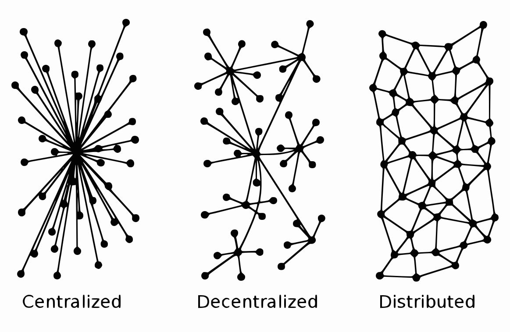</p>
<br>

Hay otro tipo de sistema distribuido en el que las computadoras de la red no tienen porqué estar ubicadas en el mismo lugar (*grid* o red en malla). En este ejemplo, se conectan entre sí mediante un protocolo de comunicaciones global y forman un sistema heterogéneo en el que los nodos de la red no tienen porqué tener instalado todos el mismo software.

Una de las redes de computación distribuida más populares vio la luz a mediados de 1999, cuando la *Universidad de California en Berkeley* lanzó el proyecto *SETI@Home*. Entonces descargabas en el disco duro de tu ordenador paquetes de datos obtenidos por el SETI, y en los momentos que tu computadora estaba inactiva (cuando saltaba el salvapantallas) comenzaba a ejecutarse en segundo plano un programa que procesaba esos paquetes de datos. Al finalizar, tu computadora devolvía los paquetes ya procesados y comenzaba la descarga de nuevos paquetes de información sin procesar para empezar de nuevo. Esto lo hacían usuarios en todo el mundo, de una forma totalmente desinteresada más allá de la colaboración con un proyecto interesante.

<p align="center">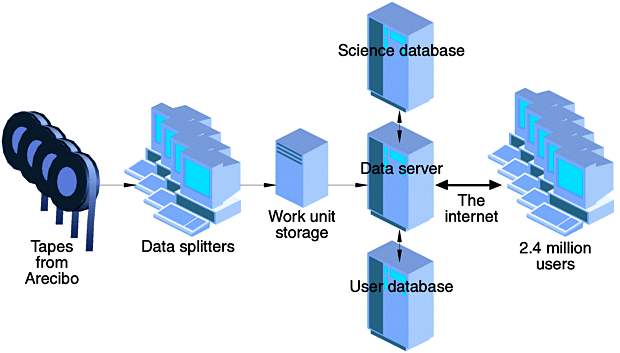</p>
<br>

Con el paso de los meses la red fue creciendo, creando una red de computadoras enorme y ayudando así a conseguir un objetivo común. Llegó a tener cerca de 2,4 millones de usuarios. En este caso, la búsqueda de inteligencia extraterrestre se potenciaba utilizando el radiotelescopio de Arecibo (Puerto Rico), entonces el más grande del mundo. Este proyecto hoy día sigue activo y tiene casi 300.000 ordenadores activos realizando cómputos distribuidos por todo el mundo.

Otros proyectos similares fueron *Einstein@Home* que tiene como objetivo buscar ondas gravitacionales en el universo, o *Rosetta@Home* que busca diseñar nuevas proteínas con la colaboración de casi un millón de computadoras.

La red de *Bitcoin*, así como la de *Ethereum* y otros protocolos populares, son redes de computación distribuida que sigue los mismos principios, pero en ella podemos encontrar dos tipos de agrupaciones de nodos. Mayoritariamente encontraremos una red distribuida de tipo grid, donde los nodos no tienen porqué estar ubicados en el mismo lugar geográfico y cada nodo puede estar en un punto diferente del mundo. Se conectan entre sí mediante un protocolo de comunicación propio y se descargan la misma información periódicamente. Por otro lado una parte minoritaria de los nodos conforma una red distribuida de tipo cluster, es decir, computadoras conectadas entre sí y ubicadas en el mismo sitio.

<p align="center"><br><i>Centro de minería *Bitcoin* en Islandia.</i></p>
<br>

La mayor parte de ellos son clusters de computadoras que procesan la información previamente descargada con las capacidades que tengan disponibles, normalmente la suma de los procesadores y ALU (unidad aritmético-lógica). Finalmente comparten con el resto de nodos de la red global el resultado, contribuyendo mediante un algoritmo de consenso en el mantenimiento de un sistema de almacenamiento de información bastante seguro como es su propia cadena de bloques.

En una red distribuida como la de *Bitcoin* no tienen porqué estar todos los nodos conectados a la totalidad del resto de los nodos, resultaría complicadísimo. En este supuesto, se tendría que tener abiertas centenares de miles de conexiones bidireccionales en todos los nodos, lo que no es razonable ni eficaz. Así que en realidad, en *Bitcoin* se comparte la misma información replicada entre todos los nodos, donde entre muchos otros datos se encuentran unos nodos participantes de la red que se va actualizando periódicamente. De ese modo basta con establecer comunicación con algunos nodos cercanos que a su vez estos estarán conectados a otros nodos creando algo parecido a una red neuronal. De ello se encarga *Bitcoin* como protocolo, el software que todo nodo participante en la red debe tener instalado y debidamente configurado.

Hoy en día se puede decir que el sistema computacional descentralizado por antonomasia es el que utiliza *Bitcoin*, ya que no posee uno o varios nodos centrales que se encargan de almacenar y procesar la información de la cadena de bloques. De ser así perdería todo su valor, pues la confianza en el consenso de la mayoría de los nodos es la principal característica del protocolo. Al fin y al cabo se creó con tal fin; prescindir de una entidad centralizada que pudiera manipular la información registrada y almacenada o censurar el uso de *Bitcoin*. Tal y como se ha explicado antes, todos los nodos de la red participan de un modo u otro en hacer la red lo más rápida y segura posible.

<p align="center"><br><i>Concentración de nodos de *Bitcoin* accesibles que se encuentran en países de todo el mundo.</i></p>
<br>

La diferencia principal entre un sistema descentralizado y uno distribuido es cómo y dónde se realiza la toma de decisiones y cómo la información es compartida entre los nodos del sistema. En un sistema descentralizado no hay un punto único de decisión. Cada nodo toma la decisión que más le conviene en función de las reglas de consenso que el operador del nodo ha elegido libremente. El resultado del conjunto del sistema es la respuesta colectiva. Los nodos en un sistema descentralizado no tienen conocimiento del estado de la totalidad del sistema, pero toman las decisiones que más le convienen con la información que tienen.

Por contra, en un sistema centralizado existe una entidad central compuesta de una o varias computadoras, que se encarga de la toma de decisiones para el resto de nodos en la red. Algunos de los ejemplos de sistemas centralizados más conocidos son los sistemas que utilizan empresas como *Google*, *Amazon*, *Microsoft*, *Facebook*, *Twitter*, *Netflix*, etc. Cuando se participa en cualquiera de estas redes, por ejemplo como usuario registrado, son estas entidades centrales quienes toman la decisión sobre cómo se va a gestionar la información, pudiendo así modificarla, moverla o directamente eliminarla.

<p align="center">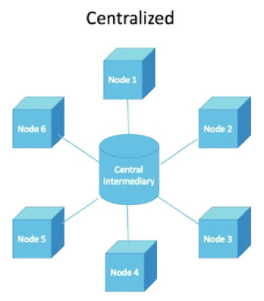</p>
<br>

Una de las prácticas más empleadas en sistemas centralizados a día de hoy es la recopilación masiva de datos para su posterior estudio, análisis y comercio, mayoritariamente con fines lucrativos, pero en otros casos con fines gubernamentales, justificando estas redes de híper vigilancia con motivos de seguridad de estado.

### Seguridad

Puesto que los protocolos *Blockchain* se utilizan principalmente para transferir valor - y detrás de este “valor” suele estar el dinero -,  la mayoría de los ataques tienen relación directa con la pérdida de fondos a través de las carteras (*wallets*), el descuido de sus propietarios a la hora de gestionar su claves, así como la utilización de algún software que no ha sido analizado o probado adecuadamente para la gestión de sus fondos. Hay innumerables casos en prácticamente todas estas tecnologías. Así pues, el punto más débil en la seguridad de un software que implica gestión de claves es el propio usuario. Este problema es antiquísimo, ya pasaba con los teléfonos móviles, con las tarjetas de crédito y con las cajas fuertes. Aunque nuestras claves sean hoy en día más largas y más aleatorias, seguimos apuntándolas en un *post-it*, mandándolas por email (en claro), gurdándolas en un documento llamado “*my_bitcoin_wallet_keys.txt*” en el escritorio del ordenador o perdiéndolas por olvido o despiste (formateo del disco duro, etc).

Por otro lado, las tecnologías que implementan protocolos *Blockchain* necesitan distribuir su base de datos (los archivos que contienen los registros de información en el tiempo) entre varios nodos o computadoras diferentes, es decir, necesitan tener permanentemente estos archivos sincronizados entre los nodos que conforman su red. Esto es una de las características que hacen más fuertes a este tipo de protocolos, pero esta “seguridad” depende exponencialmente del número de nodos de los que se componga la red. Es decir, si la red dispone tan solo de 3 o 4 nodos su nivel de seguridad será mucho menor y su seguridad podría verse más comprometida que si tuviera 1000 nodos, como es el caso de la red de *Bitcoin* a día de hoy. Otras redes como la de *Ethereum* disponen de algo más de 7000 nodos.

<p align="center">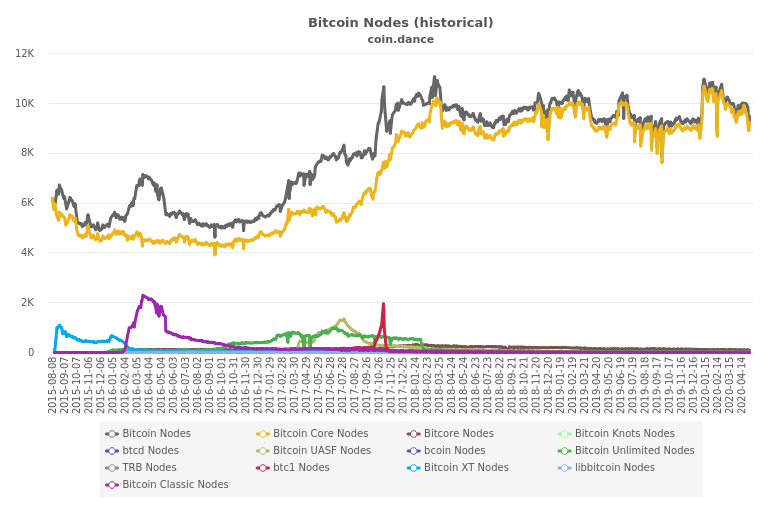</p>
<br>

El “*ataque del 51%*” es un posible escenario en el que se ve comprometida la seguridad y la integridad de la información en más de la mitad de los nodos que conforman una red. Si bien es cierto que a mayor número de nodos más dificultad de realizar dicho ataque, solo estaríamos aumentando la dificultad de sufrir un ataque de este tipo, pero no eliminas el problema. En redes con muchos nodos como la red de *Bitcoin* es bastante difícil, pero no imposible, por lo que no es suficiente, además tiene que haber una prueba de trabajo (*proof of work*) que no es más que una serie de cálculos matemáticos muy complicados y pseudo-aleatorios para obtener un resultado esperado.

De todas las variables de los protocolos *Blockchain* quizás el más importante y determinante, a la hora de escribir la información de los bloques y de la seguridad frente a supuestas modificaciones en el registro, sea la variable *targetDifficulty*. A este dato también se le llama simplemente *target* o "*Bits*" si se hace referencia al empaquetado de datos en el bloque. Se trata de un número entero de 256 *bits* representado como un número decimal muy grande, tanto que abarcaría el rango de números existentes entre `0 y 2^256-1`. El siguiente número sería el valor hexadecimal máximo que podría tomar la variable *targetDifficulty*:

<p align="center">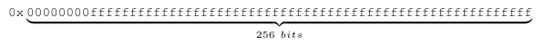</p>
<br>

En el bloque se almacena como un número decimal de coma flotante truncando, por ejemplo, el valor hexadecimal anterior quedaría representado de la siguiente forma:

<p align="center">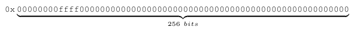</p>
<br>

La dificultad es el resultado de dividir el valor máximo entre el valor actual de la variable *targetDifficulty*, tal y como se muestra en la siguiente fórmula:

<p align="center">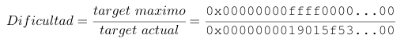</p>
<br>

Hay que tener en cuenta el valor de la variable *targetDifficulty* en cada caso. Es una de las variables más importantes a tener en cuenta a la hora de obtener el *hash* adecuado del bloque antes de incorporarlo a la cadena como un bloque válido. Así pues la prueba de trabajo o *Proof of Work* tendrá mayor o menor dificultad. En el protocolo de *Bitcoin* se define una regla que dice que el *hash* del bloque ha de ser un número menor o igual al valor de esta variable *targetDifficulty* en ese momento. De modo que si el *hash* obtenido como candidato a generar un bloque fuese un número menor o igual al de *targetDifficulty* habría posibilidades para que el *hash* candidato sea válido para generar un nuevo bloque, aunque de forma adicional se han de cumplir otras condiciones. Por el contrario, si el *hash* obtenido como candidato fuera un número mayor que el valor de esta variable *targetDifficulty*, este quedaría desestimado, entonces habría que incrementar el valor de la variable nonce y repetir todo el proceso para generar un *hash* nuevo. El siguiente gráfico muestra la variación de la dificultad a lo largo del tiempo:

<p align="center">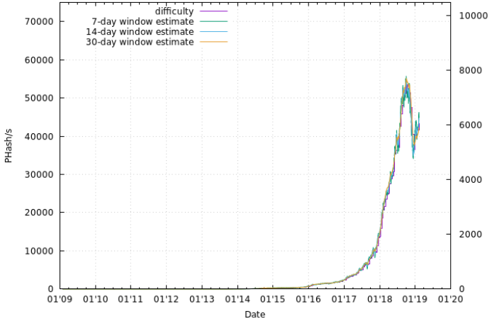</p>
<br>

Esto dificulta más el poder modificar la integridad de la información en el registro de la cadena de bloques. Por otro lado, los propios protocolos *Blockchain* tienen la información ligada entre los diferentes bloques con un resumen o hash de la información que contiene el bloque anterior, por lo que si se diera el caso de una manipulación con éxito en un bloque, debería realizarse un recálculo de toda la información que existe desde el bloque manipulado hasta el último bloque de la cadena y propagar esta nueva información en al menos el 51% de los nodos. Con la computación binaria que utilizamos actualmente se torna algo matemáticamente posible, pero físicamente (por cuestión de tiempo y energía) muy improbable, teniendo en cuenta que cada aproximadamente 10 minutos la cadena más larga de bloques se propaga de nuevo por toda la red.

Otro punto débil en prácticamente toda tecnología que se precie está “en casa”, es decir, los propios desarrolladores de la tecnología. Un desarrollador o un grupo de desarrolladores de una tecnología que implementa protocolos de tipo *Blockchain* podrían ingeniárselas para incorporar con cierta habilidad a la rama de desarrollo algunas vulnerabilidades que y pasar totalmente desapercibidos. A veces estas acciones ocurren involuntariamente, fruto de un error humano o despiste, y son otros terceros los que explotan estas vulnerabilidades.

Puede parecer un método muy seguro tener la información distribuida, descentralizada y sincronizada, y de hecho es una buena práctica para conseguir que sea más difícil modificar la información, pero esto no lo convierte en un sistema totalmente fiable y seguro. En el mundo de la seguridad computacional apenas hay nada 100% seguro.

No olvidemos que se trata de *Software*, es decir, un recurso que funciona en una computadora, y ésta funciona con electricidad. La electricidad es un recurso natural que no siempre podría estar presente en el momento que más falta nos pueda hacer, por no hablar de la intervención o cese de las redes de comunicación. También existen causas naturales por las que una computadora podría dejar de funcionar, por ejemplo tormentas magnéticas vía erupciones solares, aunque si se diera tal caso, la pérdida (temporal o no) de nuestros fondos probablemente no sea el mayor de nuestros problemas.

## Principales métodos criptográficos y de seguridad aplicados

Los puntos de esta sección son de carácter informativo. Son breves textos explicativos sobre conceptos que pertenecen a la ciencia de la criptología y sus dos ramas principales (criptografía y criptoanálisis), y su aplicación e influencia en protocolos como *Bitcoin* y otros derivados.

### Función elíptica Weierstrass

Las peculiaridades de los campos primos permiten simplificar la ecuación de *Weierstrass* no homogénea, obteniendo en el proceso lo que se llama la forma corta de *Weierstrass* representada como `y² = x³+ax+b`. En el caso particular del protocolo *Bitcoin*, la curva elíptica que se usa se conoce como la curva de Koblitz secp256k1, que se define en los Estándares para Criptografía eficiente y cuya ecuación es `y² = x³+7`, ya que en *Bitcoin* la la constante “`a`“ tiene valor `0` y la constante “`b`“ tiene valor `7`.

<p align="center">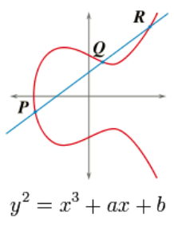</p>
<br>

La función o curva elíptica de Weierstrass se utiliza en el proceso de generación de claves tanto pública como privada. En otros protocolos diferentes de *Bitcoin* se podrían emplear otras curvas elípticas similares.

### Codificación Base58

Base58 es un grupo de esquemas de codificación de binario a texto utilizados para representar números enteros grandes como texto alfanumérico, creado por *Satoshi Nakamoto* para la creación de claves tanto públicas como privadas en el proceso de generación de direcciones en *Bitcoin*. Desde entonces se ha aplicado a otros protocolos similares a *Bitcoin* y también a algunas aplicaciones completamente distintas como los hashes que se emplean en IPFS o la forma de acortar las URL que tiene Flickr. Es similar a Base64, pero se ha modificado para evitar caracteres y letras no alfanuméricos que pueden parecer ambiguos cuando se imprimen como `0` (cero), `O` (mayúscula o), `I` (i mayúscula) y `l` (ele minúscula), así como los caracteres no alfanuméricos `+` (más) y `/` (barra).

### Función hash RIPEMD-180

La principal aplicación de las funciones hash en criptografía es la de crear una "huella digital" de la información a tratar antes de aplicar un algoritmo de firma digital. Las funciones hash también se han utilizado para diseñar códigos de autenticación de mensajes o MACs, y para derivación de claves. La mayoría de las aplicaciones requieren de las funciones hash que sean resistentes a la preimagen, es decir, que sea difícil encontrar un hashing de entrada a un valor dado. Para los algoritmos de firma digital, uno también suele necesitar resistencia a la colisión, es decir, que debería ser difícil encontrar dos entradas distintas con el mismo resultado hash. En el caso de *Bitcoin* la función RIPEMD-180 se utiliza en el proceso de creación de la clave pública cuando se genera una dirección del protocolo.

### Función hash SHA-256

Se trata de una función hash iterativa y unidireccional que puede procesar datos de entrada, como un cadena de texto o un archivo, para producir una representación condensada de longitud fija llamada *digest*. Este algoritmo determina de la integridad de los datos de entrada, es decir, cualquier cambio en los datos de entrada producirá un digest diferente. Esta propiedad es útil en la generación y verificación de firmas digitales y códigos de autenticación de mensajes, así como la generación de números aleatorios o *bits*.

En el caso de *Bitcoin*, la función hash SHA-256 se utiliza con varios propósitos, desde la generación del par de claves pública y privada hasta en el tratamiento de la información de cada bloque de datos de la cadena.

### Árbol de Merkle

Cada bloque de la cadena de bloques tiene una cabecera (*header*) con información que relativa al bloque en cuestión. Un dato muy importante de esta cabecera es una variable llamada *merkleRoot*, se trata de un resumen *hash* de todas las transacciones que se incluyen en el bloque. Para calcularlo se emplea una función *hash* SHA-256 siguiendo un orden específico. Cada vez que una nueva transacción es aceptada el valor de esta variable se modifica. Para obtener el *hash* final, también llamado *hash root* se han de concatenar los datos de las transacciones ubicados en los nodos hoja del árbol, en grupos de dos. De ese modo, por cada dos transacciones se obtiene un hash nuevo que será incluido en un nuevo vector que repetirá la acción hasta llegar al *hash root* tal y como se muestra en la siguiente imagen:

<p align="center">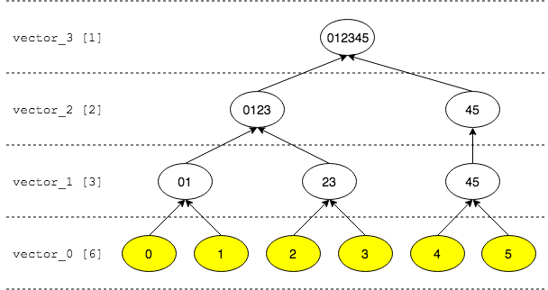</p>
<br>

Cada uno de los vectores v =〈v1, v2 ,..., vn−1, vn〉irá reduciendo  el número de nodos o elementos mediante la siguiente función recursiva por intervalos o algoritmo de complejidad O(n):

<p align="center">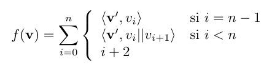</p>
<br>

## Registro y tratamiento de la información

### Veracidad Vs. integridad de la información

Es posible que el lector haya escuchado o leído en diferentes medios de comunicación afirmaciones tal como “*En las tecnologías Blockchain la información es completamente inalterable y fiable*”. Nada más lejos de la realidad, es un error muy común que es necesario precisar y aclarar, pues hay que tener en cuenta la dificultad de realizar algunas acciones, no la imposibilidad. La información que se almacena en la base de datos que gestiona un protocolo *Blockchain* (los archivos que se actualizan y distribuyen por toda la red de nodos) puede modificarse, con mayor o menor éxito, pero se pueden modificar. En caso contrario entran en juego una serie de algoritmos de consenso que actuarán en consecuencia, o bien desechando información, generando información nueva o creando cadenas de bloques alternativas. Como ya he comentado anteriormente en el apartado de seguridad, depende de la cantidad y calidad de los nodos que conforman la red y si se trata de una red centralizada, descentralizada o distribuida.

Por otro lado, la información registrada en los archivos que contienen los datos de los bloques, no siempre es relativa a transacciones, también se puede almacenar información de diferentes maneras y de varios tipos y formatos, siempre “*bits*”. Por ejemplo, el código de un pequeño *script* o programa que haga algo (correctamente o no), una fotografía (al fin y al cabo son *bytes*), o algo tan común como una cadena de texto como un simple saludo, publicidad, felicitaciones de cumpleaños o una declaración de amor. Esto también es información (*bytes*), y no tiene por qué ser veraz, podría generar un mensaje en un bloque que afirme “*Dos más dos es igual a siete*” o “*La tierra es plana*” o “*Los elefantes pueden volar*”. Por lo tanto, la integridad de la información en la cadena de bloques es relativamente real, en cuanto a que dependiendo del tipo de red, número de nodos y el nivel de seguridad implementado podría resultar más o menos difícil de manipular. Pero la fiabilidad y veracidad de (todos) los datos es algo que no se puede asegurar, pues no todo son transacciones y álgebra.

### Sellado de tiempo

El sellado de tiempo o *timestamp* es muy antiguo, tanto que mucho anterior a la computación, a lo largo de la historia muchas personas han tratado de buscar un método lo más fiable posible para asegurar que una información ha sido generada en un momento del tiempo concreto, fácilmente demostrable y que sea muy difícil de manipular. Entre esas personas quizás las más notables sean *Stornetta* y *Haber*.

<p align="center"></p>
<br>

*Stuart Haber* y *Scott Stornetta* tuvieron una novedosa idea allá por el año 1991, un sistema de registros con sellado de tiempo, inmutable y distribuido. Algunas personas consideran una de las bases que inspiraron lo que hoy se conoce como *Blockchain*, aunque directamente no tiene nada que ver, no es equiparable. Por aquella época, al menos *Stornetta* estaba en los "*cypherpunk mailing list*", junto con otras personas muy relevantes del mundo de la criptología y la computación. Se vieron altamente influenciados por el trabajo de *David Chaum* con *DigiCash*, y otros "criptógrafos rebeldes" con actitud, que por entonces crearon un movimiento inspirado en la criptografía de clave pública o asimétrica de otros dos conocidos criptógrafos: *Diffie* y *Hellman*.

*Stornetta* y *Haber* escribieron un paper titulado “*How to Time-Stamp a Digital Document*” patentando así su trabajo, trabajo que unos años más tarde inspiraría a muchas otras personas, muy probablemente también a *Satoshi Nakamoto*. El primer problema al que se tuvieron que enfrentar *Stornetta* y *Haber* era la confianza en una entidad centralizada. Enseguida vieron que era posible prescindir de esta, solo hacía falta una red de muchos “colaboradores” o “verificadores”. Tres años después de registrar su trabajo sobre el sellado de tiempo, fundaron Surety, cuyo objetivo principal era ofrecer servicios de sellado de tiempo utilizando su patente. Al principio usaban un sistema cuanto menos curioso, publicaban los hashes de los clientes en la sección de "Noticias y objetos perdidos" del periódico *The New York Times*, ingeniosa manera de utilizar un registro público con sellado de tiempo, inmutable y distribuido.

Hoy en día el sellado de tiempo o *timestamp* que se utiliza para datar la información en el mundo de la computación (y por extensión a protocolos *Blockchain*) es un dato denominado *epoch* o *Unix time*. Este dato variable tiene como valor un número entero que representa la cantidad de segundos que han transcurrido desde el 1 de enero de 1970 a las 00:00:00. En el momento de la creación de este documento el *epoch* o *Unix time* tiene un valor de 1588269325. Hay varias páginas en la red desde las que se puede consultar el *epoch* que representa una fecha y hora concreta.

La variable *timestamp* es uno de los datos que se incluyen en la generación de mensajes y transacciones de la red, y también es uno de los datos fundamentales en la composición de la  cabecera de cada uno de los bloques.

### Otros usos

Hasta ahora siempre hemos hablado de los protocolos *Blockchain* como un recurso tecnológico que nos servirá para generar, verificar y sincronizar la información almacenada en archivos distribuidos entre los nodos de una red de computadoras, y esa información es principal y mayoritariamente transacciones de valor, comúnmente asociadas directamente al dinero.

Pero se pueden utilizar para otros usos menos conocidos o menos utilizados, como puede ser la ejecución de pequeños *scripts* o programas, algunos conocidos como *smart contracts*, registro de información no relacionada con dinero, por ejemplo registro de la propiedad, trazabilidad de obras de arte, medicamentos o algo tan primitivo e ingenioso como la ocultación de la información a través de diferentes técnicas que van desde la criptografía clásica y moderna hasta la esteganografía digital.

El uso más extendido es sin duda la ejecución de *smart contracts*, de los cuales hablaremos más adelante en detalle.

## Smart Contracts

### Propósito general

El criptógrafo y jurista Nick Szabo publica en 1994 un paper en el que define por primera vez el término Smart Contract, donde más allá de un protocolo transaccional y computerizado que ejecuta una acción u otra en base al cumplimiento de unas condiciones, además ha de cumplir una serie de condiciones contractuales comunes como las "condiciones de pago", "derechos de retención", "confidencialidad" y el "cumplimiento de las condiciones de un contrato". De este modo se consigue minimizar las excepciones maliciosas o accidentales, se minimizan los intermediarios, y se reducen las pérdidas por fraude y costes.

1. Satisfacer las condiciones contractuales comunes.

<p align="center">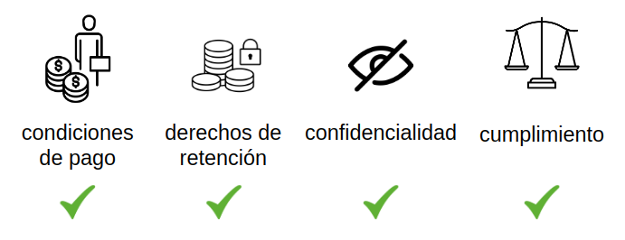</p>
<br>

2. Minimizar las excepciones maliciosas y accidentales
3. Minimizar los intermediarios
4. Reducción de pérdidas por fraude y costes.

<p align="center"></p>
<br>

Según la definición formal de Szabo, los *smart contracts* y los “Digital cash protocols” deben permitir pagos en línea y deben tener en común algunas características con el dinero tradicional en papel o metal, que son "impugnabilidad", "confidencialidad" y "divisibilidad".

### Funcionamiento a grandes rasgos

El concepto de *smart contracts* de Nick Szabo fue otra de las influencias que tuvo *Satoshi Nakamoto* a la hora de desarrollar *Bitcoin*, pues el hecho de procesar una transacción implica directamente el uso de un *script* que hace las funciones de un smart contract en la red de *Bitcoin*, y también es así en las demás redes de los otros protocolos *Blockchain*, además el propio protocolo permite que los usuarios incluyan sus propios *scripts* o *smart contracts* a la hora de generar una transacción. Esto brinda un montón de posibilidades, permite crear aplicaciones descentralizadas que usen este protocolo como base.

<p align="center">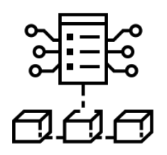</p>
<br>

De hecho, de todas las tecnologías que implementan *Blockchain*, la que más ha explotado el recurso de los *smart contracts* es sin duda alguna *Ethereum*. Se hizo muy popular por extender estos más allá de las transacciones empleando para ello un lenguaje de programación muy sencillo llamado *Solidity*, creado en 2014 por Gavin Wood, uno de los creadores del protocolo *Ethereum*. *Solidity* es un lenguaje de programación orientado a objetos (OOP), muy fácil de escribir, muy manejable y sobre todo con una curva de aprendizaje muy rápida, pues se trata de un lenguaje muy parecido a otros ya existentes y muy conocidos como JavaScript. Es también un lenguaje Turing Complete, lo que lo convierte en algo muy versátil y dinámico, pero más delicado a la hora de controlar los procesos de ejecución. Al ser un lenguaje Turing Complete permite realizar iteraciones sobre procesos que si no se controlan bien podrían entrar en una ejecución descontrolada consumiendo así recursos desmesuradamente y como ya ha ocurrido en alguna ocasión, la peŕdida de fondos, puesto que cada ciclo de cómputo en estos protocolos tiene un consumo y un gasto de una cantidad previamente depositada. En el protocolo *Bitcoin* esto no sucede, pues desde el principio *Satoshi Nakamoto* decidió que el lenguaje que se emplearía para los *scripts* o *smart contracts* de *Bitcoin* serían No-Turing complete, es decir, un lenguaje basado en pila que permita iniciar programas que siempre terminan, sin realizar iteraciones ni provocando bucles “infinitos” por un error o descuido del programador.

### Casos de uso reales

En el protocolo *Bitcoin* los *smart contracts* se usan prácticamente en su totalidad para la gestión de las transacciones y mensajes a través de la red. Aunque también se pueden hacer *smart contracts* para otros fines, la dificultad para codificarlos y entenderlos hace que la mayoría de los usuarios opten por soluciones más sencillas y rápidas como los *smart contracts* de *Ethereum*.

Entre los casos de uso reales fuera de *Bitcoin* el más notable es sin duda el de los *smart contracts* de tipo ERC-20 del protocolo *Ethereum* que se emplean para generar una cantidad finita de *tokens* y crear lo que se denomina una “Oferta Inicial de Monedas” o en inglés *Initial Coin Offering* (ICO). Una ICO es un tipo de financiación usando criptomonedas. Mayoritariamente el proceso es llevado a cabo mediante un *crowdfunding* o *crowlending*, aunque las ICOs privadas se están volviendo muy comunes. En una ICO, las criptomonedas son vendidas en forma de *tokens* a especuladores o inversores a cambio de dinero tradicional u otras criptomonedas como *Bitcoin* o *Ethereum*. Los *tokens* son vendidos como "futuras" unidades de la moneda cuando la ICO llegue a su objetivo y el proyecto se lance. En algunos casos como *Ethereum* los *tokens* son requeridos por el sistema. Una ICO puede ser una fuente de capital para una startup.​ Las ICOs pueden permitir a las startup evitar la ley e intermediarios como bancos y bolsas de valores​. Las ICOs pueden caer fuera de las regulaciones existentes, dependiendo de la naturaleza del proyecto, o ser prohibidas todas juntas en algunas jurisdicciones, como en China o Corea del Sur.

Otros *smart contracts* se emplean para realizar una trazabilidad de algunos productos de comercio internacional como alimentos, medicamentos, vehículos e incluso contenedores llenos de mercancía, como es el caso de la empresa *Maersk*, que traza el envío de su cadena de suministro de envíos por todo el mundo a través de un protocolo *Blockchain* denominado *TradeLens* desarrollado e impulsado por *IBM*.

Existen otras plataformas diferentes a las anteriormente vistas como *EOS*, *Cardano* o *Tezos*, que también implementan funcionalidades de *smart contracts* en sus protocolos.

## Lenguajes en Bitcoin, *Ethereum* y otros derivados

### Bitcoin Script

El lenguaje de programación empleado en el protocolo *Bitcoin* para gestionar las transacciones y mensajes de la red es *Bitcoin Script*, un lenguaje No-Turing complete, procedimental, estructurado, imperativo, reflexivo, basado en pila y sin comprobación de tipos. Derivado del lenguaje Forth, lenguaje popular a mediados de los años 60 que se utilizaba en el campo de la Astronomía para cálculo de trayectorias de cuerpos en órbita, cromatografías y análisis de espectros de emisión. Aunque originalmente Forth esa Turing complete, *Satoshi Nakamoto* diseñó este nuevo lenguaje exclusivo de *Bitcoin* para que fuera No-Turing complete.

Un ejemplo de uso, cuando en una transacción se generan salidas u outputs, estas salidas se establecen con un *script* de bloqueo, por lo tanto para poder utilizarlas como entradas o inputs en las nuevas transacciones antes se debe debe utilizar un *script* de desbloqueo llamado *scriptSig*. Se trata de un dato de de longitud variable que podría contener más o menos información, dependiendo de las operaciones que se quieran realizar en el *script* o el mensaje que se quiera incluir.

Adicionalmente lo utilizan los mineros para incluir mensajes de texto personalizados empleando caracteres ASCII, normalmente el nombre del minero o del pool de minería que ha resuelto el hash válido para poder minar el bloque. Aquí podemos ver un ejemplo de una transacción *Coinbase* que contiene el siguiente valor para el segmento de datos *scriptSig*.

```
0x03636004062f503253482f04358b0553084404f253000017e446522cfabe6d6d690688fb886c0df0c87cbc7ea4f7f1b5c0050bd0ac3751cfc997d9d6971328de04000000000000004861707079204e592120596f7572732047486173682e494f
```

En una representación de carácteres ASCII se vería de la siguiente forma:

```
'.c'../P2SH/.5..S.D..S....FR,..mmi....l...|.^..........7Q.......(.........Happy NY! Yours GHash.IO
```

Realmente esta cadena de 96 *bytes* es un *script* o programa con una secuencia de instrucciones ordenadas en lenguaje *Bitcoin Script*. En la siguiente muestra se pueden ver los diferentes segmentos en los que se divide la cadena hexadecimal de *scriptSig* en el caso concreto de esta transacción de tipo *Coinbase* de ejemplo:

<p align="center">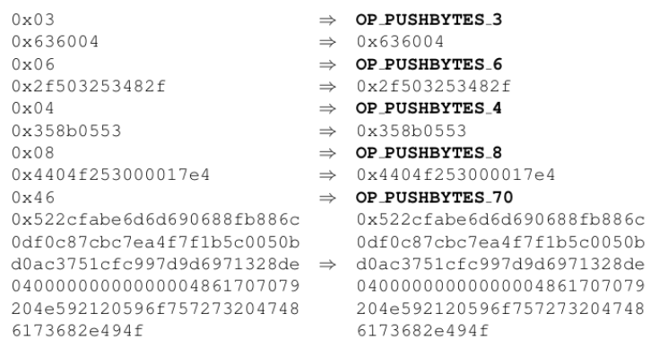</p>
<br>

Este *script* introducirá diferentes datos en una pila que inicialmente está vacía.

<p align="center">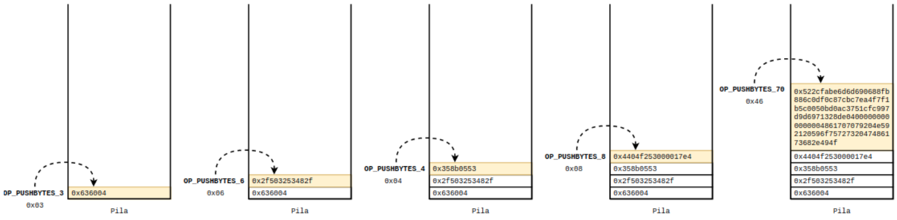</p>
<br>

Como se puede observar, este lenguaje basado en pila funciona mediante una serie de instrucciones denominadas *OP_CODES* de forma muy similar a como lo hace el lenguaje ensamblador. Un ejemplo de cómo se vería un script o smart contract en lenguaje Bitcoin Script es el siguiente:

<p align="center">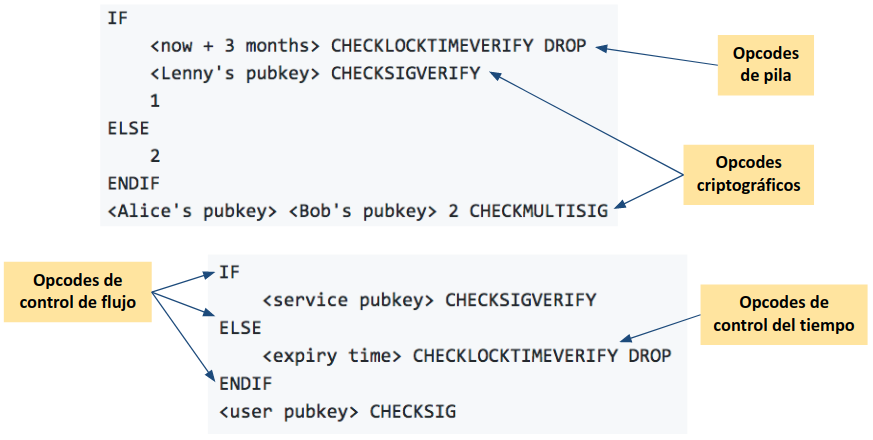</p>
<br>

Si se quisiera indagar más en el estudio y comprensiń de este lenguaje y su funcionamiento detallado está disponible un paper en GitHub con más información.

### Solidity

El lenguaje empleado en la plataforma Ethereum es Solidity. Se trata de un lenguaje turing-complete, orientado a objetos, con tipos de datos complejos y posee atributos de la programación orientada a objetos como son la encapsulación, herencia y poliformismo. Puede usar librerías de terceros y permite añadir cierta complejidad a su código. Se emplea en el desarrollo de smart contracts. Un ejemplo de cómo se vería un smart contract en lenguaje Solidity es el siguiente:

<p align="center">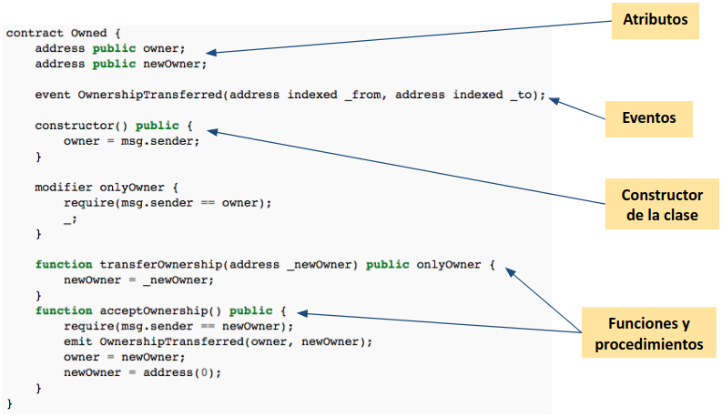</p>
<br>

La mayoría de estos smart contracts se desarrollan para la creación de tokens con fines de financiación de ICOs, pero también se desarrollan para otros fines no lucrativos ni comerciales como pueden ser sistemas de votación, compras a distancias más seguras o canales de micropagos.

### Bytecode

<p align="center">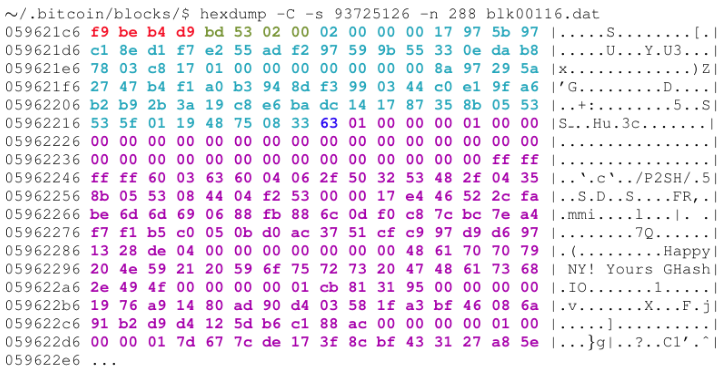</p>
<br>
